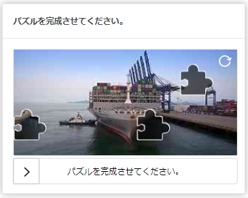
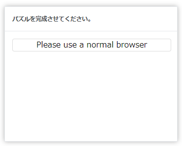
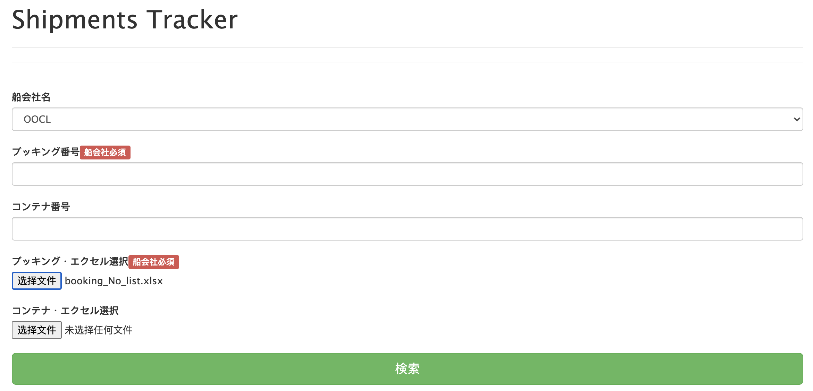
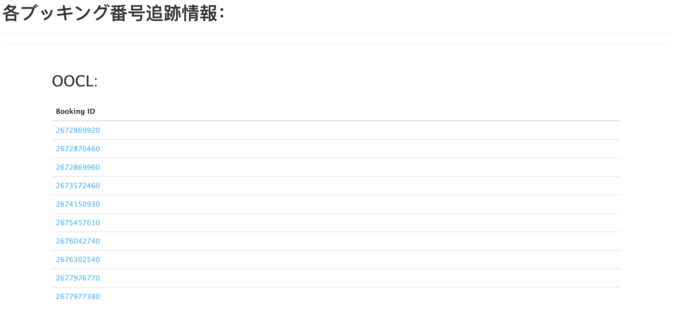
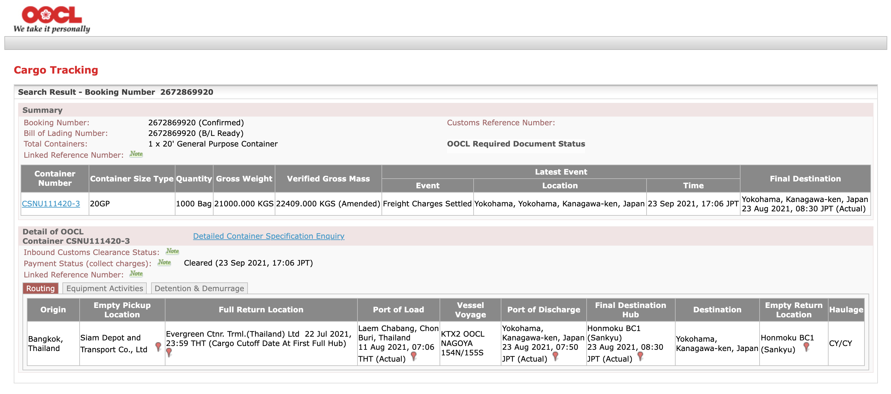
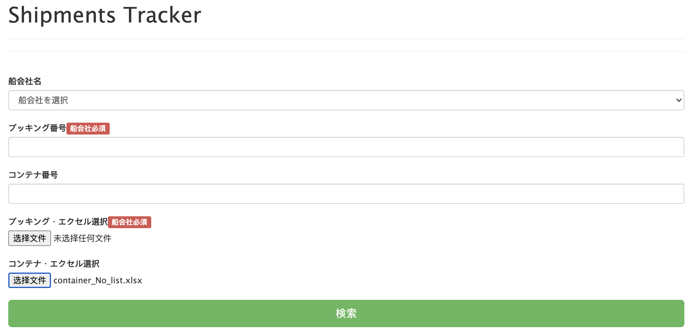
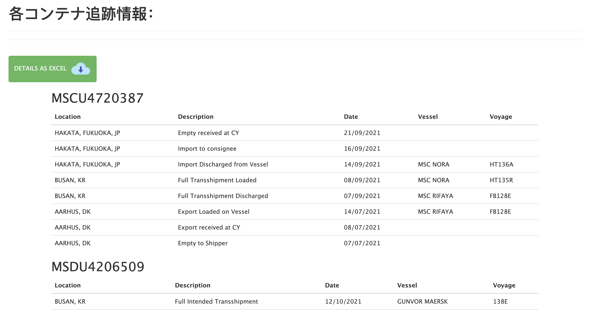

# shipTracker
booking No. and container No. auto-tracking site

# 技術案

* [playwright](https://github.com/microsoft/playwright)
* node.js

# 検証-Booking No. Tracking
 

> **Note:** 今回検証したブッキング番号は全部[OOCL船会社](https://www.oocl.com/jpn/Pages/default.aspx)なので、その追跡サイトは制限がある。

## 問題点：

* 検証用のパズルがある為、全自動化することは難しい。

  

* `playwright/puppeteer`で`キャッシュ・キャッチ`などの認証状態を再利用する方法を試し、以下の状態に止まってしまった。
  * playwrightで作る仮想ブラウザーでhtml5 `<canvas>` 要素うまくローディングできない。

  

## できること:

* index page(ブッキング番号リスト`エクセル・ファイル（ex. booking_No_list.xlsx）`をアップロード)

  

* ブッキング番号のリンクリストを作る(各番号は[OOCL船会社追跡サイト](https://www.oocl.com/jpn/Pages/default.aspx)にアクセスでき)
  > **Note:** 第一回目にアクセスする時のみ、パズルの手作業が必要

  
  
* ブッキング番号の追跡情報  

  

# 検証-Container No. Tracking
 

> **Note:** [MSCコンテナ追跡サイト](https://www.msc.com/track-a-shipment?agencyPath=gbr)にアクセスし、ウェッブ・クローリングを行う。

## 問題点：

* 同一のコンテナ番号を頻繁に上記のサイトにアクセスする場合、ブラックリストに載る可能性がある。

## できること：

* index page(コンテナ番号リスト`エクセル・ファイル（ex. container_No_list.xlsx）`をアップロード)

  
  
* 各コンテナ番号の追跡情報（詳しい物流情報）

  

* コンテナ追跡情報のまとめ（ダウンロードできる`エクセル・ファイル`）

|No.|POD|ETA|POL|ETD|Latest Movement|
|---|---|---|---|---|---|
|MEDU8686667|BUSAN, KR|02/10/2021|AARHUS, DK|04/08/2021|BUSAN, KR - Estimated Time of Arrival - 02/10/2021|
|MEDU8878490|MATSUYAMA, JP|17/09/2021|AARHUS, DK|14/07/2021|MATSUYAMA, JP - Empty received at CY - 24/09/2021|
|MEDU8811202|||||BUSAN, KR - Full Intended Transshipment - 03/10/2021|
|CXDU2180221|KOBE, JP|17/09/2021|AARHUS, DK|22/07/2021|KOBE, JP - Empty received at CY - 28/09/2021|
|FFAU3751939|HAKATA, FUKUOKA, JP|23/09/2021|AARHUS, DK|22/07/2021|HAKATA, FUKUOKA, JP - Empty received at CY - 28/09/2021|
|MSDU4206509|||||BUSAN, KR - Full Intended Transshipment - 12/10/2021|
|MSCU4720387|HAKATA, FUKUOKA, JP|14/09/2021|AARHUS, DK|14/07/2021|HAKATA, FUKUOKA, JP - Empty received at CY - 21/09/2021|
|FCIU8333712|BUSAN, KR|18/10/2021|AARHUS, DK|01/09/2021|BUSAN, KR - Estimated Time of Arrival - 18/10/2021|
|MSDU4221648|HAKATA, FUKUOKA, JP|06/09/2021|AARHUS, DK|08/07/2021|HAKATA, FUKUOKA, JP - Empty received at CY - 21/09/2021|
